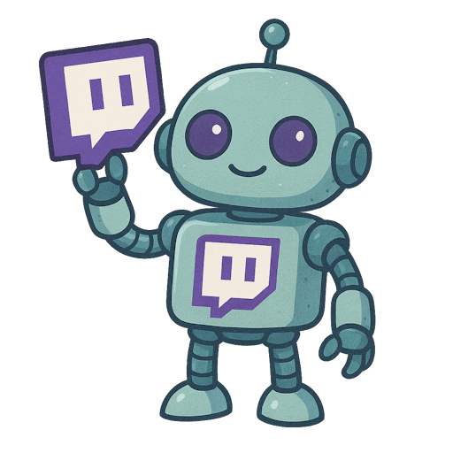

# 🤖 Twitch Live Bot

 

Bot para Twitch desenvolvido em **Node.js** que **ativa automaticamente quando a live inicia** e **desativa quando a live termina**, utilizando o sistema oficial de **EventSub e Subscriptions da Twitch API**.

O bot se conecta ao chat usando **tmi.js** e é executado em ambiente isolado via **Docker**.

---

### 🎯 Objetivo do projeto

Este projeto foi desenvolvido inicialmente para fins de estudo de **Docker** e portfólio.
<!-- No futuro, a intenção é evoluí-lo para atender múltiplos streamers de forma simples e segura. -->

## ✨ Funcionalidades

- 📡 Escuta eventos `stream.online` e `stream.offline` via **EventSub**
- 🔔 Conecta automaticamente ao chat quando a live inicia
- 🛑 Desconecta automaticamente quando a live termina
- 💬 Integração com chat da Twitch usando **tmi.js**
- 🔐 Autenticação via OAuth (Twitch API)
- 🐳 Execução totalmente containerizada com Docker
- ♻️ Controle de estado do bot baseado em eventos da Twitch

---

## 🧱 Tecnologias utilizadas

- **Node.js**
- **tmi.js**
- **Twitch API (EventSub + Subscriptions)**
- **Docker / Docker Compose**
- **Webhooks HTTP**

<!-- https://twitchtokengenerator.com/ -->